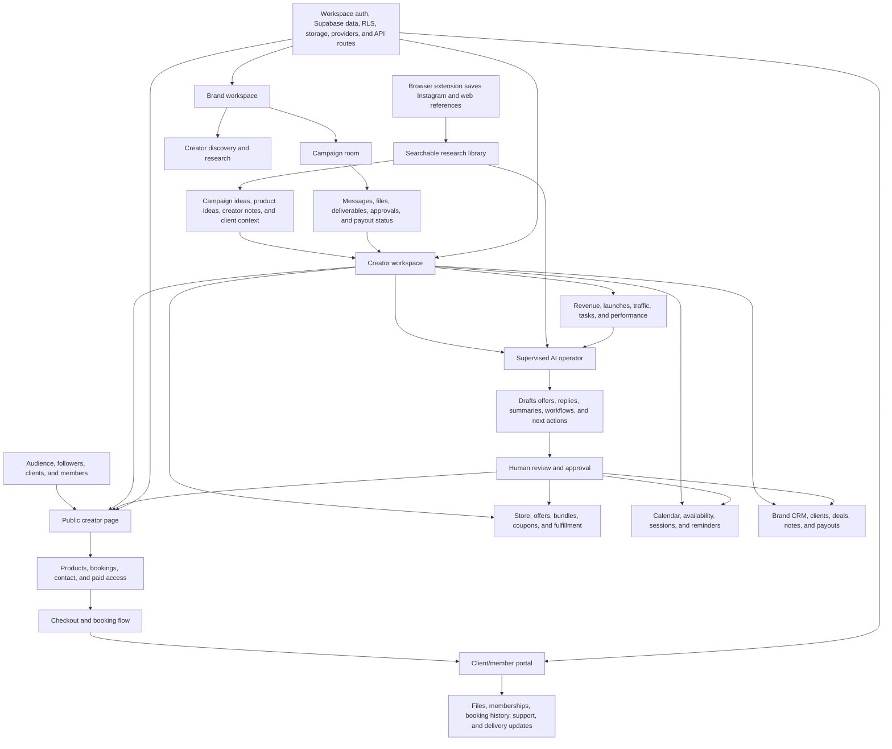
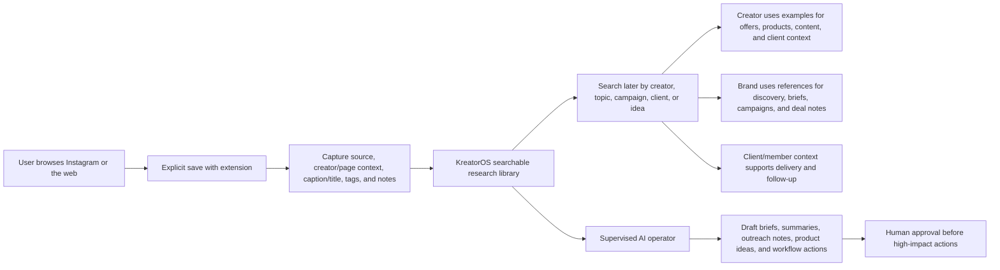

# KreatorOS


**KreatorOS is an AI business operating system for creators, brands, and client/member portals.**

It brings the core parts of a modern creator business into one workspace: public storefronts, paid products, bookings, client delivery, brand campaigns, collaboration rooms, saved Instagram research, analytics, and approval-first AI operations. The goal is not to be another bio-link page or isolated booking tool. KreatorOS is designed as the operational layer that connects audience demand, client work, brand revenue, content research, and creator workflows.

This repository contains a production-oriented Next.js SaaS implementation with authenticated workspaces, Supabase-backed schema foundations, route-protected dashboards, public creator pages, API boundaries for provider integrations, and a polished marketing surface.

## Product Positioning

Creators increasingly run businesses that look like small media companies: they sell products, book calls, manage members, collaborate with brands, deliver files, save references, track relationships, and make decisions from fragmented information. Existing tools solve pieces of this workflow, but the work still gets scattered across links, calendars, spreadsheets, folders, DMs, payment dashboards, and notes.

KreatorOS centralizes that operating context.

The product is built around four connected surfaces:

| Surface | Primary User | Purpose |
| --- | --- | --- |
| Creator workspace | Creators, consultants, educators, agencies | Run offers, bookings, products, AI workflows, analytics, brand CRM, and saved research. |
| Brand workspace | Brands and campaign teams | Discover creators, manage campaigns, collaborate on deals, track deliverables, and monitor payouts. |
| Client portal | Buyers, clients, members | Access purchases, bookings, memberships, files, support updates, and delivery history. |
| Public creator page | Audience and customers | Browse the creator profile, shop products, book sessions, and contact the creator. |

## Product Capabilities

### Creator Operations

- Creator command center for business health, tasks, offers, bookings, and revenue context.
- AI operator for drafting workflow actions, research summaries, offer updates, and next steps.
- Page builder and preview studio for public creator pages.
- Smart link commerce tools for products, short links, referrals, wallet flows, analytics, and profile settings.
- Store management for products, bundles, delivery, upsells, and private downloads.
- Booking and calendar flows for paid sessions, availability, and event management.
- Brand CRM for deals, sponsors, campaign notes, deliverables, and payout status.
- Instagram capture library for saved social content and research references.

### Brand Collaboration

- Brand command center for campaign and creator relationship management.
- Creator discovery and research workflows.
- Campaign rooms for coordination, files, deliverables, chat, approvals, and status tracking.
- Collaboration room surface for brand-to-creator execution.

### Client and Member Delivery

- Portal dashboard for client/member access.
- Booking history and purchased product access.
- Membership area for paid access.
- Product delivery and support follow-up.
- Saved Instagram/reference context where relevant to portal workflows.

### AI and Automation

- Approval-first AI suggestions.
- Assistant sessions and chat routes.
- AI research command route.
- Suggestion approval and apply endpoints.
- Provider-safe design: AI and paid providers stay behind server/API boundaries.
- Human-in-the-loop principle for money, messaging, calendar, files, and public content.

### Commerce and Providers

- Stripe checkout and billing foundations.
- Stripe Connect route foundations.
- Payment webhook route.
- Coupons, bundles, product downloads, and mock checkout completion.
- Google OAuth and calendar callback foundations.
- Redis/Upstash support for caching and rate-limiting.
- Resend and Twilio WhatsApp environment slots for transactional and alert workflows.

## Current Implementation State

This codebase is a production-shaped SaaS foundation. It includes real route structure, server boundaries, auth/session concepts, Supabase schema references, RLS references, provider integration points, and substantial UI surfaces. Some flows are still intentionally scaffolded or demo-backed so the product can evolve without hard-coding live provider behavior too early.

Important design intent:

- Keep routes stable.
- Keep providers server-side.
- Keep AI actions reviewable.
- Keep workspace ownership explicit.
- Keep demo data isolated until persistence is intentionally added.
- Keep product-specific UI inside feature modules rather than generic UI primitives.

## Architecture Overview

KreatorOS uses the Next.js App Router with route groups for each major product surface. UI components are split between shared primitives, app layout shells, and feature-owned components. Server code owns provider calls, workspace guards, API response helpers, Supabase clients, and domain services.

## Route Surfaces

### Marketing and Legal

| Route | Description |
| --- | --- |
| `/` | Marketing landing page. |
| `/privacy` | Privacy policy. |
| `/terms` | Terms of service. |
| `/ai-policy` | AI policy. |

### Authentication and Account

| Route | Description |
| --- | --- |
| `/login` | Auth entry with sign-in and sign-up mode support. |
| `/onboarding` | Role and workspace onboarding. |
| `/profile/settings` | Profile settings. |
| `/unauthorized` | Workspace permission fallback. |

### Creator Workspace

| Route | Description |
| --- | --- |
| `/creator` | Creator command center. |
| `/creator/ai-operator` | App-native AI operator. |
| `/creator/analytics` | Analytics and AI insights. |
| `/creator/agents` | Agent creation and configuration. |
| `/creator/brand-crm` | Brand deal CRM. |
| `/creator/builder` | Creator page builder. |
| `/creator/calendar` | Calendar and booking studio. |
| `/creator/chat` | Creator chat surface. |
| `/creator/instagram` | Instagram capture library. |
| `/creator/preview` | Public page preview studio. |
| `/creator/research-lab` | Research automation workspace. |
| `/creator/settings` | Creator workspace settings. |
| `/creator/store` | Store, products, bundles, and delivery. |
| `/creator/workflows` | Node-style workflow editor. |

### Smart Link Commerce

| Route | Description |
| --- | --- |
| `/creator/link` | Smart link commerce hub. |
| `/creator/link/builder` | Link page builder. |
| `/creator/link/products` | Product management. |
| `/creator/link/products/new` | New product flow. |
| `/creator/link/products/[id]` | Product edit flow. |
| `/creator/link/profile` | Link profile settings. |
| `/creator/link/analytics` | Link analytics. |
| `/creator/link/referrals` | Referral program tools. |
| `/creator/link/wallet` | Wallet and payout context. |
| `/creator/link/assistant` | Link assistant surface. |
| `/creator/link/shortlinks` | Short link management. |
| `/creator/link/settings` | Link workspace settings. |

### Brand Workspace

| Route | Description |
| --- | --- |
| `/brand` | Brand command center. |
| `/brand/discover` | Creator discovery. |
| `/brand/campaigns` | Campaign management. |
| `/brand/collab-room` | Collaboration room, chat, and deliverables. |
| `/brand/settings` | Brand workspace settings. |

### Client Portal

| Route | Description |
| --- | --- |
| `/portal` | Client/member portal dashboard. |
| `/portal/bookings` | Booking history. |
| `/portal/products` | Purchased products and delivery. |
| `/portal/membership` | Membership access. |
| `/portal/instagram` | Saved Instagram references. |

### Public Pages

| Route | Description |
| --- | --- |
| `/u/[slug]` | Public creator page. |
| `/u/[slug]/shop` | Public shop. |
| `/u/[slug]/product/[productSlug]` | Public product detail page. |
| `/u/[slug]/contact` | Public contact flow. |
| `/s/[slug]` | Short-link redirect surface. |

## API Design

API route handlers live in `src/app/api`. Shared request parsing, response helpers, and schema logic belong in `src/server/api`.

The app follows these conventions:

- Validate request payloads before using them.
- Prefer shared Zod schemas for reusable contracts.
- Return successful responses through shared helpers.
- Return expected failures through shared error helpers.
- Keep external providers behind server modules or API routes.
- Keep UI components free from paid provider calls and private keys.
- Preserve workspace and ownership checks on server-side flows.

Major API areas:

| API Area | Responsibility |
| --- | --- |
| `api/ai/*` | Assistants, research, suggestions, approval, and apply workflows. |
| `api/assistant/*` | Assistant chat, sessions, and lead capture. |
| `api/billing/*` | Billing checkout and completion redirects. |
| `api/bookings` and `api/calendar/*` | Booking and availability workflows. |
| `api/brand/*` | Brand campaigns and creator research. |
| `api/connect/*` | Provider authorization and callbacks. |
| `api/import/instagram/*` | Instagram import and remix flows. |
| `api/link-commerce/*` | Smart link commerce resources and uploads. |
| `api/pages/*` | Page builder, blocks, versions, publishing, and SEO. |
| `api/payments/*` | Checkout and webhook foundations. |
| `api/products/*` | Product records, downloads, and mock files. |
| `api/workspaces/*` | Workspace records, members, switching, and invites. |

## Data Model and Supabase

The `supabase/` folder contains the database foundation:

- `supabase/schema.sql`: consolidated schema reference.
- `supabase/rls.sql`: consolidated row-level security reference.
- `supabase/migrations/*`: incremental migrations.

Migration coverage includes:

- Auth onboarding, profiles, roles, and workspace membership.
- Workspace bootstrap policies.
- Creator page builder blocks and page versions.
- Calendar slots and booking foundations.
- Commerce, checkout, bundles, coupons, private delivery, and product access.
- Brand deals, collaboration messages, short links, and campaign context.
- AI assistants, suggestions, chat history, research runs, and operator foundations.
- Instagram capture library.
- Storage buckets and storage policy tightening.

When adding persistence:

- Add migrations rather than editing historical migrations.
- Preserve RLS ownership boundaries.
- Keep workspace/account ownership explicit.
- Avoid hard-coding generated IDs in data migrations.
- Update server services and API schemas together.

## Browser Extension

KreatorOS includes a browser extension lane for saving Instagram and web references. The extension is designed for the research behavior that already happens before creator work, brand work, and client work: people browse examples, posts, creators, captions, hooks, offers, and campaign ideas, then lose that context across bookmarks, screenshots, notes, and DMs.

The extension turns that browsing into structured workspace material. A normal user can save Instagram content or useful web references while browsing, then return later and search those saves by creator, topic, campaign, client, product idea, or note. A creator or brand team can then turn those saved references into campaign research, client context, product ideas, creator discovery, or AI-assisted drafts inside KreatorOS.

Intended outcomes:

- Save Instagram posts, Reels, captions, creators, and reference material.
- Search saved content later by topic, campaign, client, creator, or idea.
- Convert saved references into campaign research, product ideas, creator notes, client context, or AI-assisted drafts.

Extension responsibilities:

- Capture: save the source URL, platform context, visible title/caption, creator/profile cues, and user notes where available.
- Organize: attach saved content to a workspace, client, campaign, topic, or personal research library.
- Retrieve: make saved references searchable later from the KreatorOS workspace.
- Activate: help convert saved references into briefs, product ideas, outreach notes, content examples, or AI operator context.

The extension should not bypass platform rules, scrape private content, or perform hidden collection. It should behave as an explicit user-driven save action.

Source:

```text
extensions/
```

Marketing CTA:

```text
https://github.com/SahilRakhaiya05/KreatorOS/tree/main/extensions
```

Static icon:

```text
public/webstore.svg
```

## Technology Stack

KreatorOS uses a modern TypeScript SaaS stack. The important point is not only which tools are installed, but what role each tool plays in the product.

### Runtime and Application Foundation

| Role | Packages | Why It Exists |
| --- | --- | --- |
| App framework | `next` | App Router routes, server components, layouts, route handlers, metadata, and deployment-ready build output. |
| UI runtime | `react`, `react-dom` | Interactive dashboard surfaces, builders, portals, and client-side workflows. |
| Language and safety | `typescript`, `@types/node`, `@types/react`, `@types/react-dom` | Strong typing across routes, APIs, services, components, and provider adapters. |
| Build tooling | `eslint`, `eslint-config-next`, `postcss`, `autoprefixer` | Project linting and CSS processing. |

### Interface and Design System

| Role | Packages | Why It Exists |
| --- | --- | --- |
| Styling | `tailwindcss`, `tailwindcss-animate`, `tailwind-merge`, `clsx`, `class-variance-authority` | Utility styling, animation helpers, class merging, and variant-based component APIs. |
| Component foundations | `@radix-ui/react-avatar`, `@radix-ui/react-dialog`, `@radix-ui/react-dropdown-menu`, `@radix-ui/react-label`, `@radix-ui/react-scroll-area`, `@radix-ui/react-select`, `@radix-ui/react-separator`, `@radix-ui/react-slot`, `@radix-ui/react-switch`, `@radix-ui/react-tabs`, `@radix-ui/react-tooltip` | Accessible primitives for dashboards, modals, forms, settings, menus, and product surfaces. |
| Product UI layer | `frosted-ui`, local `src/components/ui` primitives | App-specific interface patterns and reusable controls. |
| Motion | `framer-motion` | Marketing polish, card reveals, modal transitions, and smoother interaction states. |
| Icons | `lucide-react`, `public/*` assets | Professional iconography, logo files, landing mockups, and the Web Store CTA asset. |
| Data tables | `@tanstack/react-table` | Structured operational views such as records, campaigns, customers, products, and reporting tables. |
| Dates | `date-fns` | Calendar, booking, scheduling, and timestamp formatting. |

### Auth, Database, and Workspace Data

| Role | Packages/Files | Why It Exists |
| --- | --- | --- |
| Supabase client | `@supabase/supabase-js` | Browser and server access to Supabase Auth, Postgres, and Storage. |
| Supabase SSR | `@supabase/ssr` | Server-aware auth/session helpers for App Router flows. |
| Schema and RLS | `supabase/schema.sql`, `supabase/rls.sql`, `supabase/migrations/*` | Workspace ownership, page builder records, commerce, storage, AI records, brand deals, and policy references. |
| Validation | `zod` | Request validation and shared API contracts. |

### AI and Operator Layer

| Role | Packages | Why It Exists |
| --- | --- | --- |
| AI SDK core | `ai` | Common model interaction layer for streaming, tool-like flows, and provider-agnostic AI work. |
| OpenAI provider | `@ai-sdk/openai` | OpenAI-backed assistant, research, and generation workflows. |
| Anthropic provider | `@ai-sdk/anthropic` | Anthropic-backed model support where configured. |
| Google provider | `@ai-sdk/google` | Google Generative AI support where configured. |
| Copilot UI/runtime | `@copilotkit/react-core`, `@copilotkit/react-ui`, `@copilotkit/runtime` | In-app assistant UX and runtime surfaces for operator-style workflows. |
| E2B desktop/runtime | `@e2b/desktop` | Controlled desktop/runtime automation foundation for advanced AI operator tasks. |

### Payments, Analytics, Caching, and Providers

| Role | Packages | Why It Exists |
| --- | --- | --- |
| Payments | `stripe` | Checkout, Connect, billing completion, webhook, and platform-fee foundations. |
| Analytics client | `posthog-js`, `@posthog/react` | Product analytics and client-side event capture. |
| Analytics server | `posthog-node` | Server-side analytics events where needed. |
| Redis client | `ioredis` | Standard Redis caching or rate-limit support. |
| Upstash Redis | `@upstash/redis` | Serverless Redis-compatible caching or rate-limit support. |
| Google provider hooks | Environment-backed OAuth and Calendar routes | Calendar, scheduling, and provider authorization flows. |
| Email and WhatsApp hooks | Resend and Twilio env slots | Transactional email and high-priority WhatsApp alert foundations. |

### Important Source Areas

```text
src/app/(marketing)      Marketing site and product positioning
src/app/(auth)           Login, callback, auth error, onboarding
src/app/(creator)        Creator workspace
src/app/(brand)          Brand workspace
src/app/(portal)         Client/member portal
src/app/(public)         Public creator pages and short links
src/app/api              API route handlers
src/server               Server-only auth, services, providers, API helpers
src/client/supabase      Browser Supabase client helpers
src/components           Shared UI and layout systems
src/features             Feature-owned product modules
supabase/migrations      Database evolution
extensions               Browser extension source
public                   Static product and brand assets
```

## Environment Configuration

Create `.env.local` from `.env.example`:

```bash
copy .env.example .env.local
```

Required for a full production-like setup:

| Variable | Purpose |
| --- | --- |
| `NEXT_PUBLIC_SUPABASE_URL` | Supabase project URL used by browser and server clients. |
| `NEXT_PUBLIC_SUPABASE_PUBLISHABLE_KEY` | Supabase publishable key for browser-safe access. |
| `NEXT_PUBLIC_SITE_URL` | App URL used by auth redirects and provider callbacks. |
| `OPENAI_API_KEY` | Server-only OpenAI key. |
| `ANTHROPIC_API_KEY` | Server-only Anthropic key. |
| `GOOGLE_GENERATIVE_AI_API_KEY` | Server-only Google AI key. |
| `E2B_API_KEY` | Server-only E2B key. |
| `STRIPE_SECRET_KEY` | Server-only Stripe key. |
| `STRIPE_CONNECT_CLIENT_ID` | Stripe Connect app client ID. |
| `STRIPE_WEBHOOK_SECRET` | Stripe webhook verification secret. |
| `GOOGLE_CLIENT_ID` | Google OAuth client ID. |
| `GOOGLE_CLIENT_SECRET` | Google OAuth client secret. |
| `REDIS_URL` | Standard Redis URL. |
| `UPSTASH_REDIS_REST_URL` | Upstash REST URL. |
| `UPSTASH_REDIS_REST_TOKEN` | Upstash REST token. |
| `RESEND_API_KEY` | Transactional email API key. |
| `TWILIO_ACCOUNT_SID` | Twilio account SID. |
| `TWILIO_AUTH_TOKEN` | Twilio auth token. |

Optional or compatibility variables:

| Variable | Purpose |
| --- | --- |
| `NEXT_PUBLIC_SUPABASE_ANON_KEY` | Legacy Supabase anon key fallback. |
| `NEXT_PUBLIC_POSTHOG_TOKEN` | Browser analytics token. |
| `NEXT_PUBLIC_POSTHOG_HOST` | PostHog event host. |
| `NEXT_PUBLIC_POSTHOG_UI_HOST` | PostHog UI host. |
| `STRIPE_PLATFORM_FEE_BPS` | Platform fee in basis points. Defaults to `0`. |
| `TRANSACTIONAL_FROM_EMAIL` | Sender identity for transactional email. |
| `TWILIO_WHATSAPP_FROM` | WhatsApp sender number. |

Security rule: never expose server-only keys through `NEXT_PUBLIC_*`.

## Local Development

Install dependencies:

```bash
npm install
```

Start the app:

```bash
npm run dev
```

Open:

```text
http://localhost:3000
```

Run a type check:

```bash
npm run typecheck
```

Build for production:

```bash
npm run build
```

On Windows PowerShell, if script execution policy blocks `npm.ps1`, run commands through `cmd`:

```bash
cmd /c npm run typecheck
```

## Available Scripts

| Command | Description |
| --- | --- |
| `npm run dev` | Start the Next.js development server. |
| `npm run build` | Create a production build. |
| `npm run start` | Start the production server after building. |
| `npm run typecheck` | Run TypeScript with `tsc --noEmit`. |
| `npm run lint` | Run the configured Next.js lint command. |

## Engineering Standards

KreatorOS follows a route-first, feature-owned architecture.

Code placement:

- `src/app` should contain route surfaces and API entrypoints.
- `src/components/ui` should contain reusable primitives without product data fetching.
- `src/components/layout` should contain shared app shells and navigation chrome.
- `src/features/*/components` should contain feature-specific React components.
- `src/features/*/config` should contain feature constants and route maps.
- `src/server/*` should contain server-only auth, provider, database, and domain services.
- `src/client/*` should contain browser-only clients and helpers.
- `src/shared/mock` should contain demo data used by prototype flows.

Implementation rules:

- Use `@/*` imports across app boundaries.
- Prefer relative imports inside the same feature module.
- Keep provider integrations behind API routes or server modules.
- Keep reusable UI generic and domain UI feature-owned.
- Add shared request schemas before adding new validated API routes.
- Preserve current demo data flow until persistence is intentionally introduced.
- Do not move route URLs unless the product change explicitly requires it.

## Quality and Review Checklist

Before shipping meaningful changes:

```bash
npm run typecheck
npm run build
```

For UI changes:

- Check desktop and mobile layouts.
- Confirm no button, card, or navigation text overflows.
- Confirm links point to real routes.
- Confirm protected routes redirect to `/login`.
- Confirm visual assets load from `public/`.
- Confirm motion does not make the interface feel jumpy.

For API changes:

- Validate inputs.
- Use shared response helpers.
- Keep secrets server-only.
- Preserve workspace permission checks.
- Update Supabase migrations when schema changes.
- Ensure provider-backed flows fail gracefully when environment variables are missing.

For AI changes:

- Keep high-impact actions approval-first.
- Treat AI output as draft material.
- Avoid putting secrets or unrelated personal data into prompts.
- Add audit context where the action affects customers, public content, files, calendars, or money.

## Security Model

KreatorOS assumes a multi-surface, multi-workspace product. Security and ownership boundaries are part of the core architecture, not an afterthought.

Core rules:

- Authenticated workspace routes must resolve the current user and active workspace.
- Server-side guards should protect creator, brand, and portal surfaces.
- Supabase RLS should mirror ownership and workspace membership assumptions.
- Provider secrets must remain server-only.
- Public routes should expose only intended public creator/page data.
- AI-generated actions should be inspectable and approval-first.
- Payment, messaging, calendar, and file actions require special review.

## Documentation Policy

Documentation should help a new contributor understand:

- What the product is.
- Which user surface they are changing.
- Where code belongs.
- Which providers and environment variables are involved.
- Which route and API contracts must stay stable.
- Which security or AI approval rules apply.

When adding a major feature, update this README or add focused documentation near the relevant feature or server module.

## Diagram

This diagram shows the product as a working business system, not just a technical stack. Audience activity, creator operations, brand collaboration, client delivery, saved research, commerce, and supervised AI all feed the same operating loop.



## How Extension Work

This diagram shows how the browser extension fits into the product without treating it as a separate toy. It starts from an intentional user save, moves through workspace organization, then becomes useful inside creator, brand, client, and AI workflows.



## Governance

- Code of conduct: [`CODE_OF_CONDUCT.md`](CODE_OF_CONDUCT.md)
- License: [`LICENSE`](LICENSE)
