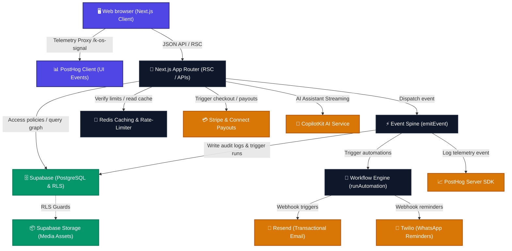

# KreatorOS Technology Stack & Technical Architecture

Welcome to the definitive technical blueprint of **KreatorOS**—the high-performance AI business operator for creators, brands, and member portals. This document provides a highly visual and detailed breakdown of our premium technical stack, server workflows, caching layer, real-time telemetry, and notification services.

---

## 🏗️ Technical Architecture Map



---

## 🛠️ Complete Technology Stack Directory

| Layer | Technology | Primary Role in KreatorOS | Configuration Status Indicator |
| :--- | :--- | :--- | :--- |
| **Core Framework** | Next.js 16 (App Router) | Server components, static optimization, dynamic API routing, page compilation. | System Baseline |
| **Type Safety** | TypeScript 5+ | Static types, interface validations, API payload typing. | System Baseline |
| **Database & Auth**| Supabase (Postgres & GoTrue) | Primary persistent data store, Row-Level Security (RLS), User Authentication. | Dynamic (`NEXT_PUBLIC_SUPABASE_URL`) |
| **Payment Gateway** | Stripe & Connect | Core product sales, user billing, checkout sessions, creator bank account payouts. | Dynamic (`STRIPE_SECRET_KEY`) |
| **Telemetry & Funnels**| PostHog Analytics | tracking click telemetry, tracking booking rates, client conversions, server events. | Dynamic (`NEXT_PUBLIC_POSTHOG_TOKEN`) |
| **High Performance** | Redis Cache & Limiter | Rate limiting expensive AI endpoints, caching slow Supabase connections. | Dynamic (`REDIS_URL` / `UPSTASH`) |
| **Email Deliverability**| Resend API | Dispatching welcome emails, checkout invoices, scheduled meeting confirmations. | Dynamic (`RESEND_API_KEY`) |
| **WhatsApp Dispatch** | Twilio Messaging API | High-priority booking alerts, meeting confirmations, delivery reminders. | Dynamic (`TWILIO_ACCOUNT_SID`) |
| **Interactive Copilot**| CopilotKit Runtime | Interactive chat interfaces, app-native agent tool executing, context sharing. | System Baseline |

---

## ⚡ Integration Details & Usage Guidelines

### 1. Telemetry and Analytics (PostHog)
KreatorOS routes all PostHog data through an internal Next.js rewrite proxy (`/k-os-signal`) to bypass client-side ad-blockers and increase tracking precision.
- **Client Tracking**: Call `captureClientEvent(eventName, properties)` from `@/client/posthog/events`. 
  - Standardized events: `booking.created`, `checkout.started`, `offer.purchased`, `operator.run_started`.
- **Server Tracking**: Handled automatically in `emitEvent` for all system-wide actions. Pushes distinct IDs and parameters to the PostHog node server instance, syncing frontend and backend funnels perfectly.

### 2. High-Performance Caching & Rate-Limiting (Redis)
We employ a multi-driver connection spine that dynamically adjusts to your deployment topology:
- **Upstash REST Driver**: Zero-overhead HTTP-based caching. Ideal for Serverless Edge runtimes.
- **ioredis VM Driver**: Direct TCP connection to a standalone Redis instance or cloud instance.
- **In-Memory Mock Fallback**: Active in local development if no credentials exist. Emulates a live Redis store locally using JS Map structures, printing details directly to your CLI.

```typescript
// Example: Rate limiting an expensive route
const result = await rateLimit(`ai_agent:${userId}`, 10, 60);
if (!result.success) {
  return Response.json({ error: "Rate limit exceeded" }, { status: 429 });
}
```

### 3. Workflow-Native Automations (Resend & Twilio)
KreatorOS workflows are designed as visual node charts. The execution engine parses triggers (e.g., `lead.captured` or `payment.succeeded`) and executes them sequentially.
- **Emails (Resend)**: Sends rich HSL-styled HTML templates (`buildEmailTemplate`) that feature automated meeting links, date badges, custom greeting messages, and receipt lists.
- **WhatsApp (Twilio)**: Sends instant mobile reminders formatted as `whatsapp:+<phone>` utilizing standard Twilio Sandbox channels.

---

## 📝 Developer Guidelines

- **Adding environment keys**: Place new keys in `.env.local` based on the `.env.example` templates.
- **Adding new telemetry**: Define the event in `src/client/posthog/events.ts` before calling `captureClientEvent` to ensure naming stays standardized.
- **Scaling Redis**: If deploying to Vercel, utilize Upstash by setting the `UPSTASH_` keys. If utilizing a Docker container locally or on AWS, set the standard `REDIS_URL`.
